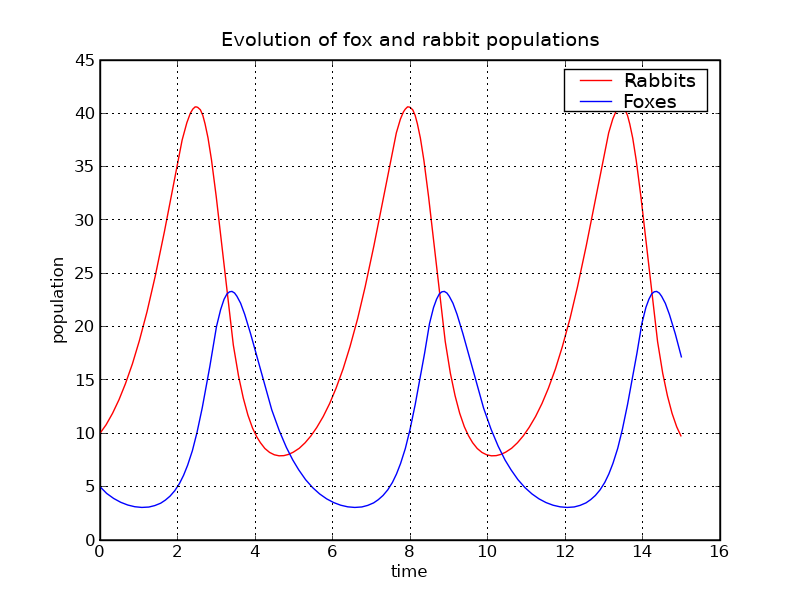
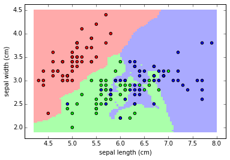
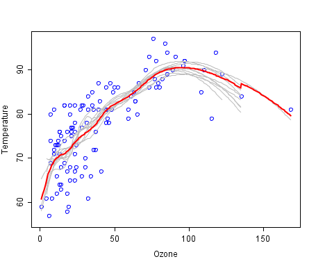
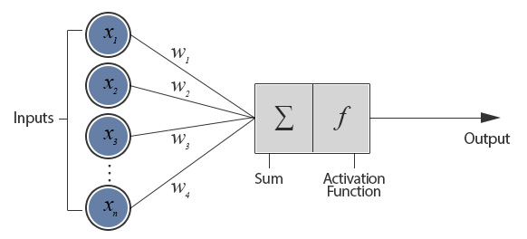
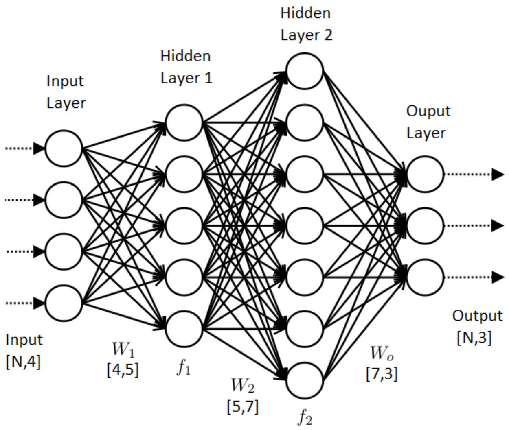

# What is Machine Learning?

## A Broad Definition...

Machine learning is an approach to making accurate predictions using experience (ie. prior information). The methods that arise from this approach attempt to algorithmically fit some function relating some "input" values to some "output" values such that the function accurately predicts future outputs from future inputs.

Or, the goal is to determine the relationship between thing a (or things a1, ..., an) and thing b (or things b1, ..., bn) even when that relationship is arbitrarily complex.

Once more, according to Vapnik "the learning process is a process of choosing an appropriate function from a given set of functions."

For example, linear regression works great when the relationship is linear, but poorly when it looks like this...

If the only class of functions you were considering were lines of different slopes, you would fail to characterize the relationship between the three variables (time, fox, and rabbit populations). Machine learning is a generalization of the linear/parametric statistical problems you are likely familiar with.

Our learning machines have two basic requirements:

1. To estimate our function from a wide variety of functions -- roughly, we want to be able to estimate the relationship no matter how complicated it might be.
2. To estimate our function using a limited number of examples.

## Major Classes of ML Problems

* **Classification/Pattern Recognition**

Given a set of observations, learn a generalizable rule that allows their discrete class to be predicted. For example, we see a series of animals with either two or four legs who do or don't bark. We want to learn to categorize animals with two legs as humans, animals with four legs who don't bark as cats and animals with four legs who do bark as dogs. We want to _partition_ the input space.

* **Regression**

Given a set of observations, learn a generalizable relationship that allows some real-valued output to be predicted. For example, we want to estimate a likely temperature after seeing a series of temperatures, times, humidities, air pressures, etc.

* **Density Estimation**

Given a set of observations, we want to describe the probability distribution of the underlying population. The most commonly associated machine learning methods are those of cluster analysis, which seek to characterize the structure of data without knowing about category membership in advance -- things that share a probability distribution are more likely to be from the same phenomenon than those that do not. 

## A Brief History...

(taken largely from Ch. 1 of Vapnik's Statistical Learning Theory)

* **The parametric approach of the 1920-30's** - The classical, maximum likelihood methods developed largely by Fisher in the 1920's pose the problem of statistical inference as 1) assuming the structure of the process that generated observed values -- eg. the assumption of normality -- in order to 2) estimate the parameters of a predefined function. This parametric method of inference works well when 1) the laws that generate the random error of observation and 2) the form of the function whose parameters are to be estimated are both known in advance. The number of problems that satisfy those two conditions are very few indeed. This approach reached its "golden age" from 1930-1960, but remains in common currency in some part by historical accident (its alternative was developed by the Russians during the Cold War) and in some part by many scientists being unwilling to give half an ass to learn math.

* **Empirical Risk Minimization in the 1960's** - It is easy to forget that many of the classical methods were developed without computers, and evaluating complex datasets was laborious such that it neared impossibility. When we got our hands on our computers it became clear that the ideas that underlie the parametric approach to inference were naive, however convenient. It is from this realization that the practice of "data analysis" that seeks to describe data rather than make formal statistical inductions followed. The development of the [perceptron](https://en.wikipedia.org/wiki/Perceptron), which mimics very crude neurons that update input "weights" depending on repeated input to estimate category labels prompted the development of *Emperical Risk Minimization*. The ERM principle suggests that functions that generalize well to future inputs, ie. functions that describe the input/output relationship well, should be trained by minimizing the observed error (risk) on training examples. The major intellectual developments that followed were the description of the conditions for *consistency* of ERM -- when ERM will arrive at the best possible solution -- and the *quality* of the functions fit by ERM.

* **Backpropagation in the 1980's** - This practice remained unpopular due to the limitations of perceptions and related learning algorithms, but the development of backpropagation that allowed multiple instances of a learning algorithm to be chained together renewed interest. Backpropagation allows the observed error at the output of a chain of stacked algorithms to be... propagated... backwards... through to the input, so that all weights or parameters of the function estimator can be intelligibly updated rather than just those of the output. 

* **Deep Learning in the 2000's** - Backpropagation is great, but computationally expensive. The advent of cheap GPUs that allow the matrix algebra necessary for deep algorithms to be performed in a tractable period of time.

From this history we can see the major components of the machine learning approach:

1) Models are evaluated by a loss value: the difference between the correct answer and the predicted answer

2) Models are improved by updating their parameters to minimize that loss value

3) Multiple models, or units of models, are combined so increase the generality of the functions that can be estimated.

## Common ML Algorithms

Good god there are so many. The folks that put together scikit-learn for Python made this flowchart that gives a very high-level overview of the major types

* **Decision Trees** - For this I defer to this lovely presentation: http://www.r2d3.us/visual-intro-to-machine-learning-part-1/

* **Support Vector Machines** - In the simplest example, we learn some line, plane, or hyperplane that best separates classes.

* **Artificial Neural Networks** - Models are composed of neurons, arranged in layers, with particular connectivity between (or within) layers. Neurons can be arbitrarily complex, from the simplest weight-only neuron to the hypercomplex LSTM neurons. Models also get their power from their architecture, as exemplified convolutional neural networks.

And of course we have to [deep dream a little bit](https://www.youtube.com/watch?v=SCE-QeDfXtA)

* **k-Means Clustering** - Divide data into k clusters such that each observation is identified as the cluster with the nearest mean value. One of the simplest clustering algorithms.

## Resources

* [Foundations of Machine Learning](https://mitpress.mit.edu/books/foundations-machine-learning)

* [Vapnik 1999 - An Overview of Statistical Learning Theory](http://math.arizona.edu/~hzhang/math574m/Read/vapnik.pdf)

* [Vapnik - The Nature of Statistical Learning Theory](https://link.springer.com/chapter/10.1007/978-1-4757-2440-0_1)

* [A tour of ML algorithms](https://machinelearningmastery.com/a-tour-of-machine-learning-algorithms/)
